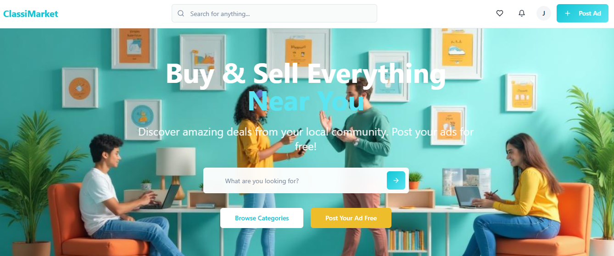

# ClassiMarket



A modern, responsive classified marketplace platform built with React, TypeScript, and Tailwind CSS. ClassiMarket provides a comprehensive solution for online classified advertisements with user authentication, admin panel, and mobile-responsive design.

## ✨ Features

### 🏪 **Core Marketplace Features**
- **Featured Listings**: Showcase premium ads on the homepage
- **Category-based Browsing**: Organized product categories with icons
- **Advanced Search**: Search and filter functionality
- **Responsive Design**: Fully optimized for desktop, tablet, and mobile devices
- **Image Gallery**: Multiple image support for listings

### 👥 **User Management**
- **User Authentication**: Login and registration system
- **User Profiles**: Personalized user dashboards
- **Role-based Access**: Support for regular users and administrators
- **Protected Routes**: Secure access to user-specific features

### ⚡ **Admin Panel**
- **User Management**: View, edit, and manage user accounts
- **Ad Moderation**: Review, approve, or reject advertisements
- **Category Management**: Create and manage product categories
- **Statistics Dashboard**: Comprehensive analytics and insights
- **Subscription Management**: Handle user subscription plans
- **System Settings**: Configure platform-wide settings

### 📱 **Mobile-First Design**
- **Responsive Layout**: Optimized for all screen sizes
- **Mobile Navigation**: Hamburger menu with slide-out sidebar
- **Touch-friendly Interface**: Optimized for mobile interactions
- **Adaptive Tables**: Card layouts for complex data on mobile devices

## 🛠 Tech Stack

### **Frontend**
- **React 18** - Modern React with hooks
- **TypeScript** - Type-safe development
- **Vite** - Fast development server and build tool
- **React Router DOM** - Client-side routing
- **TanStack Query** - Server state management

### **UI Framework**
- **Tailwind CSS** - Utility-first CSS framework
- **shadcn/ui** - High-quality, accessible UI components
- **Radix UI** - Low-level UI primitives
- **Lucide React** - Beautiful, customizable icons

### **Form & Validation**
- **React Hook Form** - Performant forms with minimal re-renders
- **Zod** - TypeScript-first schema validation
- **Input OTP** - One-time password input components

### **Utilities**
- **class-variance-authority** - Component variant management
- **clsx** - Conditional CSS classes
- **date-fns** - Date utility library
- **Sonner** - Toast notifications

## 🚀 Getting Started

### Prerequisites
- Node.js (v18 or higher)
- npm or yarn package manager

### Installation

1. **Clone the repository**
   ```bash
   git clone <repository-url>
   cd olx
   ```

2. **Install dependencies**
   ```bash
   npm install
   # or
   yarn install
   ```

3. **Start the development server**
   ```bash
   npm run dev
   # or
   yarn dev
   ```

4. **Open your browser**
   Navigate to `http://localhost:5173`

### Build for Production

```bash
npm run build
# or
yarn build
```

### Lint Code

```bash
npm run lint
# or
yarn lint
```

### Preview Production Build

```bash
npm run preview
# or
yarn preview
```

## 📁 Project Structure

```
src/
├── components/           # Reusable UI components
│   ├── ui/              # shadcn/ui components
│   ├── auth/            # Authentication components
│   ├── Header.tsx       # Main navigation header
│   ├── Footer.tsx       # Site footer
│   └── ...
├── pages/               # Page components
│   ├── admin/           # Admin panel pages
│   ├── Index.tsx        # Homepage
│   ├── Browse.tsx       # Browse listings
│   └── ...
├── layouts/             # Layout components
│   └── AdminLayout.tsx  # Admin panel layout
├── contexts/            # React contexts
│   └── AuthContext.tsx  # Authentication context
├── hooks/               # Custom React hooks
├── types/               # TypeScript type definitions
├── lib/                 # Utility libraries
└── assets/              # Static assets
```

## 🔐 Authentication & Authorization

### User Roles
- **Regular Users**: Can create accounts, post ads, browse listings
- **Administrators**: Full access to admin panel and system management

### Protected Routes
- `/dashboard` - User dashboard (regular users only)
- `/admin/*` - Admin panel (admin users only)
- `/post-ad` - Create new advertisement (authenticated users)
- `/settings` - User settings (authenticated users)

### User Menu Behavior
- **Regular Users**: See Dashboard, Settings, and Logout
- **Admin Users**: See Admin Panel, Settings, and Logout (Dashboard hidden)

## 🎨 UI Components

The project uses shadcn/ui components built on top of Radix UI primitives:

- **Form Components**: Input, Textarea, Select, Checkbox, Switch
- **Navigation**: Dropdown Menu, Tabs, Breadcrumb
- **Feedback**: Toast, Alert, Progress, Badge
- **Layout**: Card, Dialog, Sheet, Accordion
- **Data Display**: Table, Avatar, Calendar

## 📱 Responsive Design

### Breakpoints (Tailwind CSS)
- **sm**: 640px and up (tablet)
- **md**: 768px and up (desktop)
- **lg**: 1024px and up (large desktop)
- **xl**: 1280px and up (extra large desktop)

### Mobile Features
- Hamburger navigation menu
- Card-based layouts for tables
- Stacked form layouts
- Touch-optimized button sizes
- Optimized image displays

## 🧩 Key Features Implementation

### Admin Panel
- **Mobile-responsive sidebar**: Slide-out navigation on mobile
- **Dashboard**: Overview statistics and recent activity
- **User Management**: Mobile-friendly user cards and desktop table view
- **Ad Management**: Approve/reject ads with detailed views
- **Analytics**: Comprehensive statistics with responsive charts

### Category Management
- **Grid and Table Views**: Switch between display modes
- **Mobile Optimization**: Card layouts for mobile screens
- **Icon Integration**: Visual category representation
- **Color Coding**: Customizable category colors

## 🌐 Deployment

The project is configured for deployment on Vercel:

```json
{
  "buildCommand": "npm run build",
  "outputDirectory": "dist",
  "framework": "vite"
}
```

## 🔧 Configuration Files

- **`tailwind.config.ts`** - Tailwind CSS configuration
- **`vite.config.ts`** - Vite bundler configuration
- **`tsconfig.json`** - TypeScript configuration
- **`components.json`** - shadcn/ui components configuration

## 🤝 Contributing

1. Fork the repository
2. Create a feature branch: `git checkout -b feature/your-feature`
3. Commit your changes: `git commit -m 'Add your feature'`
4. Push to the branch: `git push origin feature/your-feature`
5. Submit a pull request

## 📝 License

This project is licensed under the MIT License - see the [LICENSE](LICENSE) file for details.

## 🆘 Support

For support and questions:
- Open an issue on GitHub
- Check the documentation
- Review the component examples

## 📊 Browser Support

- Chrome (latest)
- Firefox (latest)
- Safari (latest)
- Edge (latest)

## 🏗 Development Notes

### Code Style
- TypeScript for type safety
- ESLint for code linting
- Consistent component structure
- Mobile-first responsive design

### Performance Optimizations
- Vite for fast development and optimized builds
- Code splitting with React Router
- Optimized image loading
- Minimal bundle size with tree shaking

### Accessibility
- ARIA labels and roles
- Keyboard navigation support
- Screen reader compatibility
- High contrast support

---

**ClassiMarket** - Building the future of online classified advertising 🚀